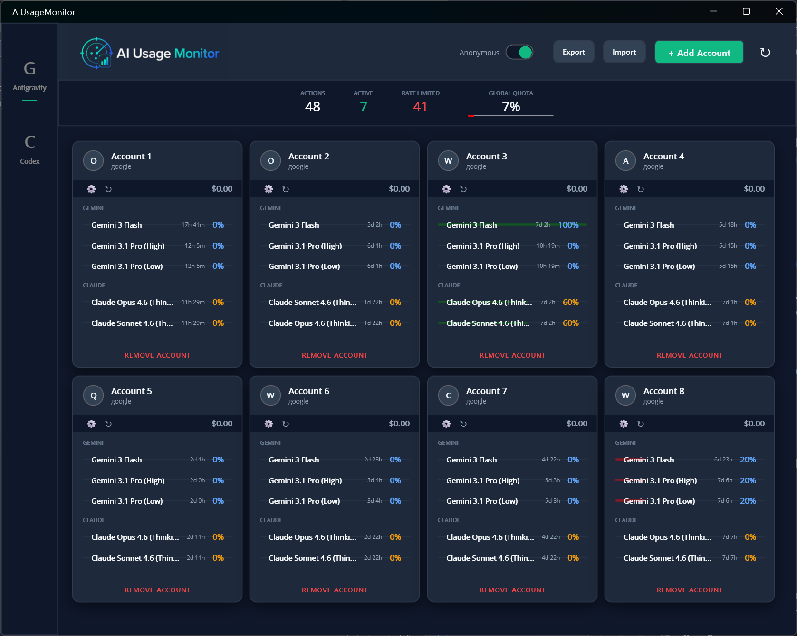
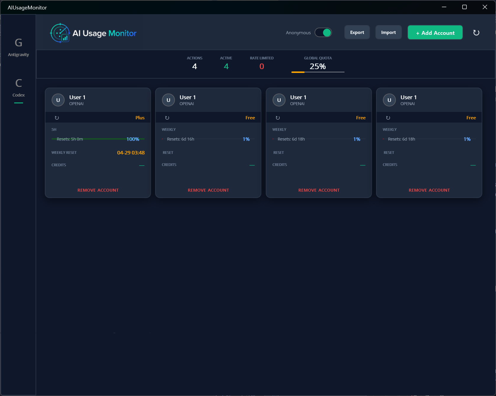

# AIUsageMonitor

> English README: [README.md](README.md)

> Antigravity, Codex, Cursor 사용량을 한 화면에서 확인하는 Premium AI 사용량 모니터링 대시보드.

## 개요

AIUsageMonitor는 여러 AI 계정의 사용량, 제한 상태, 쿼터 주기를 한 곳에서 추적할 수 있는 .NET MAUI 데스크톱 앱입니다. 현재는 Windows 데스크톱 환경에 맞춰 최적화되어 있습니다.

## 미리보기

| Antigravity (Google) | Codex (OpenAI/GitHub) |
| :---: | :---: |
|  |  |

## 다운로드

Releases 페이지에서 최신 빌드를 다운로드할 수 있습니다.

## 주요 기능

### 멀티 서비스 지원
- Antigravity 계정 및 모델별 사용량 추적
- Codex 세션 및 주간 쿼터 모니터링
- 로컬 Cursor 데이터베이스 기반의 Cursor Composer 컨텍스트 사용량 모니터링
- 다양한 계정 설정을 한눈에 볼 수 있는 통합 대시보드

### Windows 트레이 워크플로우
- 마우스 좌클릭 및 더블클릭을 통한 창 복원 기능을 지원하는 시스템 트레이 아이콘
- 종료 확인 대화 상자를 거쳐 트레이로 최소화(Close-to-tray)되는 동작
- 창을 닫을 때 종료/트레이 최소화 선택 상태를 기억하는 옵션
- 종료 확인 대화 상자를 통해 앱이 백그라운드(트레이)로 들어갈 때 시스템 트레이 알림 표시

### 새로고침 및 모니터링
- 헤더 영역을 통한 수동 전체 새로고침
- 현재 활성화된 탭 전체를 새로고침하는 `F5` 단축키 지원
- 향상된 응답성을 위해 동시성을 제한하여 동작하는 백그라운드 새로고침 큐
- 네트워크 통신 상태를 고려한 재시도(Retry) 기반의 계정 정보 갱신 동작

### 개인정보 보호 및 사용성
- 화면 공유 시 민감한 정보를 숨겨주는 익명(Anonymous) 모드 지원
- 기본값 초기화 및 수동 업데이트 기능을 지원하는 Antigravity 모델 목록 관리
- 로컬/세션 기반 계정을 위한 Cursor 계정 이름(별칭) 변경 기능 지원
- Antigravity, Codex, Cursor, 알림(Notifications), 설정(Settings) 탭으로 구성된 직관적인 UI

### 지능형 알림 (Intelligent Notifications)
- **시스템 트레이 알림**: 계정 리셋 및 사용량 경고 발생 시 즉시 Windows 토스트 알림을 보냅니다.
- **Slack 다이제스트 (Webhook)**: 사용 가능한 모든 계정 상태 요약을 지정된 Slack 채널로 즉시 전송합니다.
- **예약 알림 (Bot Token)**: 리셋 시각에 맞춰 Slack 서버 측에 메시지 발송을 예약합니다. **앱이 완전히 종료되어 있어도 리셋 시점에 알림을 받을 수 있습니다.**
- **중복 방지**: 스마트 해싱을 통해 동일한 리셋 주기 내에서 불필요한 중복 알림이 가는 것을 방지합니다.
- **설정 가이드**: 손쉬운 Slack API 연동을 위해 인앱 설정 가이드를 제공합니다.

## 요구 사항

- .NET 10.0 SDK
- .NET MAUI 워크로드가 포함된 Visual Studio 2026
- Windows 10/11

## 소스에서 빌드

1. 저장소를 클론합니다.
2. Visual Studio에서 `AIUsageMonitor.sln` 파일을 엽니다.
3. NuGet 패키지를 복원합니다.
4. `Windows Machine` 대상으로 실행 및 빌드합니다.

## 인증 방법

### Antigravity (Google)
1. **Antigravity** 탭을 엽니다.
2. **+ Add Account**를 클릭합니다.
3. 브라우저에서 Google OAuth 인증 흐름을 완료합니다.
4. 앱이 access token과 refresh token을 플랫폼 보안 저장소를 통해 로컬에 안전하게 저장합니다.
5. refresh token이 있는 경우, 만료 전에 백그라운드에서 토큰을 자동으로 갱신합니다.

### Codex (OpenAI / GitHub)
1. **Codex** 탭을 엽니다.
2. **+ Add Account**를 클릭합니다.
3. OpenAI 로그인, GitHub 로그인 또는 수동 토큰 입력 중 하나를 선택합니다.
4. 추출된 세션/토큰 정보를 로컬에 저장하고 새로고침 큐를 통해 쿼터 모니터링 정보를 업데이트합니다.

### Cursor
1. 먼저 Cursor IDE를 설치하고 로그인해 둡니다.
2. **Cursor** 탭을 엽니다.
3. **Add Current Account**를 클릭합니다.
4. 앱이 로컬 Cursor 데이터베이스를 읽고 현재 로컬 세션을 자동으로 가져옵니다. 별도의 Cursor ID나 비밀번호 입력은 필요하지 않습니다.

## Antigravity 모델 목록

- 기본적으로 미리 구성된 모델 프리셋(Gemini, Claude, GPT 등) 목록을 사용하여 시작합니다.
- **Update Model List**: 계정의 쿼터 데이터를 스캔하여 새로 발견된 모델을 대시보드에 추가합니다.
- **Set to Default**: 활성 모델 목록을 다시 기본 설정 값으로 되돌립니다.
- 설정(Settings) 탭을 통해 모델의 활성화 여부나 세부 사항을 유연하게 조정할 수 있습니다.

## Cursor 모니터링

- 로컬 Cursor 설치 정보를 조회하여 Composer 컨텍스트 사용량, 남은 한도, 리셋 예정일 및 계정 상태를 자동으로 추적합니다.
- Cursor의 설치 상태나 세션이 감지되지 않는 경우 설정을 위한 안내 가이드를 제공합니다.
- 대시보드에서 각 Cursor 카드 이름을 직관적으로 변경하여 관리할 수 있습니다.

## 참고 사항

- 버전: `v1.0.7`
- Windows 시스템 트레이 유틸리티 워크플로우에 최적화되어 있습니다.

## 개인정보 보호

- 토큰 및 설정 값들은 모두 사용자의 로컬 환경에만 저장됩니다.
- 앱은 서비스 제공자 엔드포인트와 직접 통신합니다.
- 민감한 계정을 사용하기 전에 오픈된 소스 코드를 검토해 보시는 것을 권장합니다.

## 라이선스

MIT 라이선스에 따라 배포됩니다. 자세한 내용은 `LICENSE` 파일을 참고하세요.
